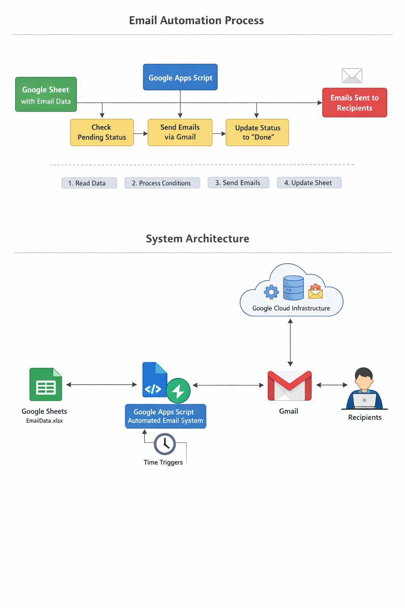

# Email Automation System

Automated email sending system using Google Apps Script and Google Sheets.

## Features
- Reads data from Google Sheets
- Sends emails automatically
- Updates status after sending
- Skips invalid or completed rows

## Workflow
Google Sheet → Apps Script → Gmail → Status Update

## Setup
1. Upload sheet to Google Sheets
2. Open Extensions → Apps Script
3. Paste Code.gs
4. Run sendEmailsBest()

## Use Case
Bulk email automation with validation and tracking
